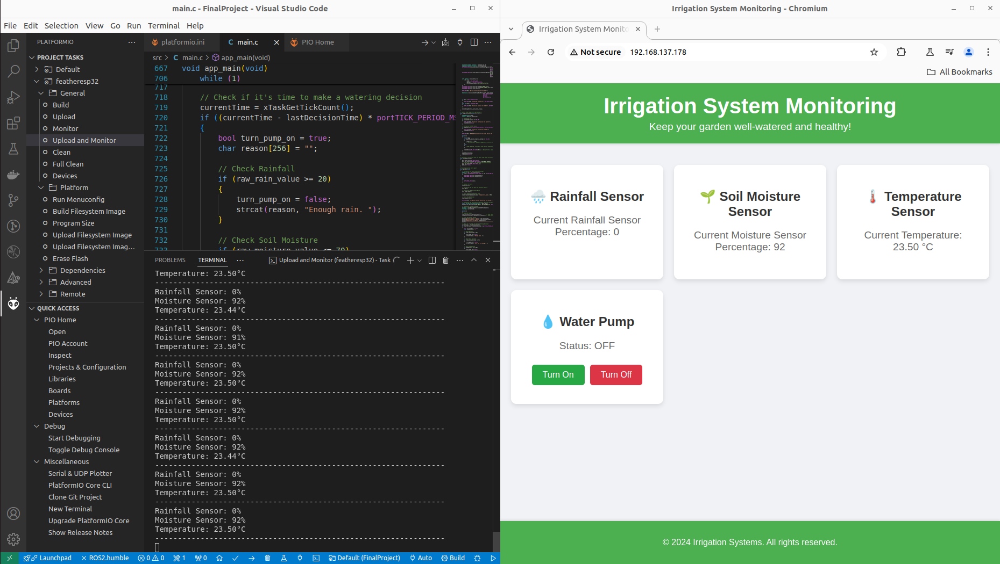

# ESP32-Based Smart Irrigation System

## Table of Contents

- [Introduction](#introduction)
- [Features](#features)
- [Hardware Requirements](#hardware-requirements)
- [Software Requirements](#software-requirements)
- [Setup Instructions](#setup-instructions)

## Introduction

The **ESP32-Based Smart Irrigation System** is an automated gardening solution designed to optimize water usage and ensure your plants receive the right amount of water. Leveraging various sensors and an intuitive web interface, this system monitors environmental conditions and controls a water pump accordingly, promoting efficient irrigation practices.

## Features

- **Real-Time Monitoring**: Tracks rainfall, soil moisture, and ambient temperature.
- **Automated/Manual Pump Control**: Turns the water pump ON/OFF based on sensor data and from the webpage.
- **Web Interface**: Provides a user-friendly HTML/CSS dashboard to view sensor readings and manually control the pump.
- **Wi-Fi Connectivity**: Allows remote access and monitoring from any device connected to the network.
- **Energy Efficient**: Minimizes water wastage by making informed watering decisions.

## Hardware Requirements

To build the Smart Irrigation System, you will need the following components:

- **ESP32 Development Board**: ESP32 Huzzah32
- **Rain Sensor**: Analog output type
- **Soil Moisture Sensor**: Analog output type
- **MCP9808 Temperature Sensor**: I2C interface
- **Relay Module**: 5V relay module for pump control
- **Water Pump**: Compatible with the relay module
- **Power Supply**: Appropriate for ESP32 and water pump
- **Connecting Wires**
- **Breadboard**

## Software Requirements

- **ESP-IDF Framework**: Official development framework for ESP32
- **CMake and Ninja**: Build system tools
- **Git**: Version control
- **Serial Driver**: For flashing the ESP32
- **Web Browser**: To access the web interface

**Connections:**

- **Rain Sensor**
  - VCC → 3.3V
  - GND → GND
  - Analog Output → GPIO32 (ADC1 Channel 4)
  
- **Soil Moisture Sensor**
  - VCC → 3.3V
  - GND → GND
  - Analog Output → GPIO33 (ADC1 Channel 5)
  
- **MCP9808 Temperature Sensor**
  - VCC → 3.3V
  - GND → GND
  - SDA → GPIO23 (I2C SDA)
  - SCL → GPIO22 (I2C SCL)
  
- **Relay Module**
  - VCC → 5V (ensure compatibility)
  - GND → GND
  - IN → GPIO17 (Pump Relay Control)
  
- **Water Pump**
  - Connected to the relay module as per relay specifications.

**Note:** Always ensure proper power ratings and isolation when connecting the pump and relay to avoid damage to the ESP32.

## Setup Instructions

### 1. Clone the Repository
```bash 
git clone https://github.com/mostafa-IK03/IoT-Based-Smart-Agriculture-System-Using-ESP32.git
cd IoT-Based-Smart-Agriculture-System-Using-ESP32 
```
### 2. Install PlatformIO
```bash
https://platformio.org/install
```
### 3. Configure the Project

### 4. Build and Flash

